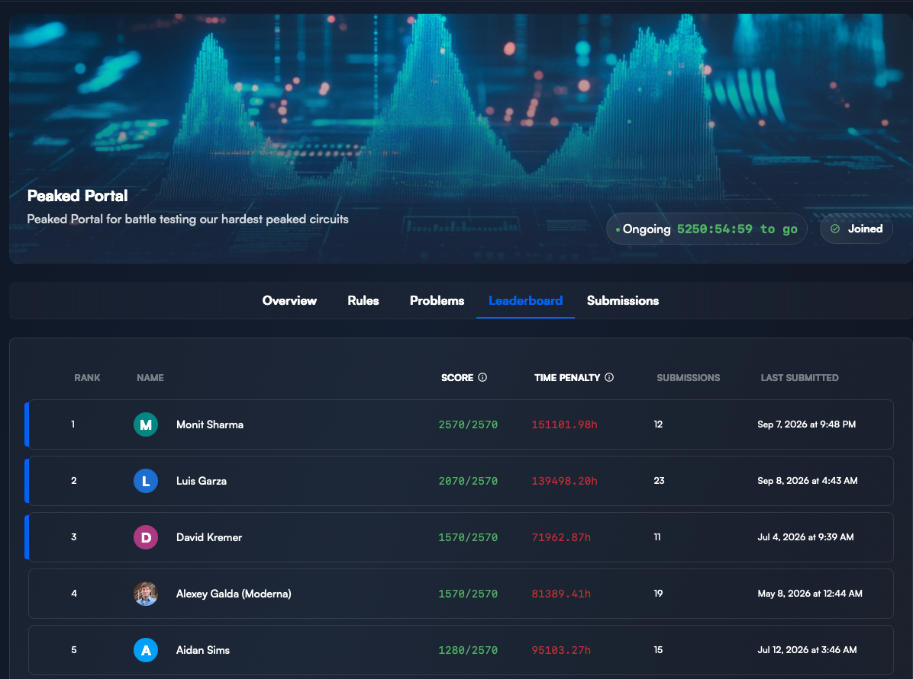
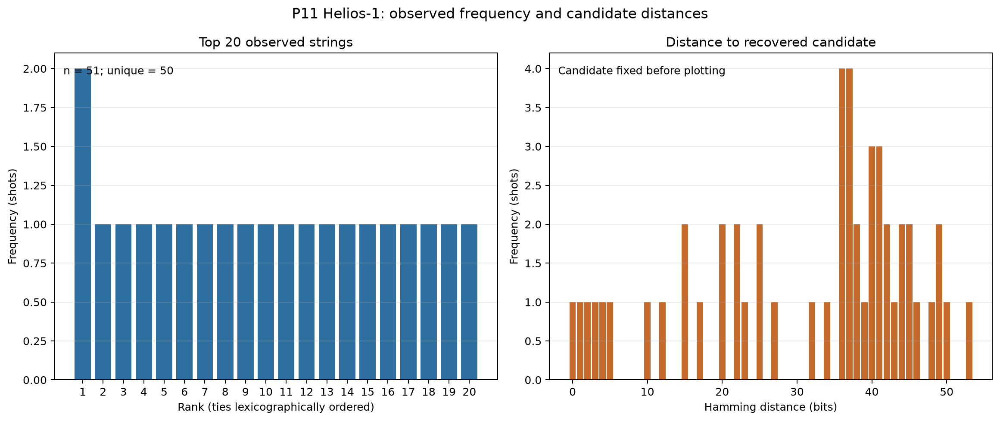
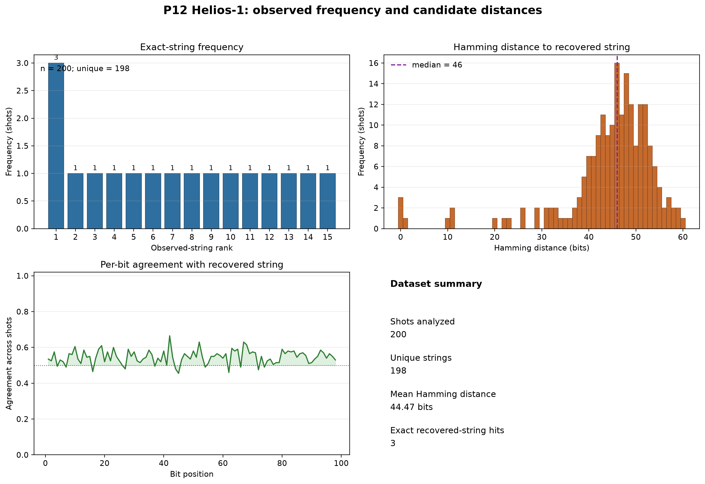

# Peaked Circuit — P11/P12 quantum recovery

This repository is the focused, reproducible research record for the P11 and
P12 peaked circuits run on Quantinuum Helios-1 hardware. The hardware produced
noisy 98-bit samples; deterministic classical decoding was then used to recover
the accepted bitstrings.

The active research scope is limited to P11 and P12; earlier circuit work
remains archived for provenance. The GitHub repository name is
`peaked_circuits`.

## Executive summary

| Problem | Hardware run | Cost | Recovery result |
|---|---:|---:|---|
| P11 | 50 requested shots; 50 analyzed after duplicate-frame repair | 282.98 HQC | Weighted medoid and cluster consensus agreed on the accepted answer |
| P12 | 200 reconstructed shots | 1,373.4 HQC | Most frequent string, weighted medoid, and cluster consensus agreed on the accepted answer |

The P11 and P12 answers were externally accepted. This is evidence of
successful recovery from hardware samples; it is not, by itself, a claim of
quantum advantage.

## External verification

The results were submitted through the [BlueQubit Peaked Portal leaderboard](https://app.bluequbit.io/hackathons/oEOtLSSrPSVH60Ah?tab=leaderboard).
The supplied leaderboard screenshot shows Monit Sharma ranked first with a
score of **2570/2570**, providing corroborating evidence that the hackathon
submissions were accepted by the portal. The screenshot does not independently
attribute individual score points to P11 versus P12; the raw hardware records,
deterministic recovery evidence, and per-problem accepted-answer records remain
available in the linked P11 and P12 packages below.



## What was run

### P11

P11 was run for **50 shots** on Helios-1. The provider framing initially
reconstructed 51 records, but record 46 was an exact duplicate of record 0.
That duplicate was removed from the active analysis, while the original
51-record reconstruction was preserved for auditability.

Accepted recovered bitstring:

```text
10101110111010011111100010110011101011101011111001010101101100001110101110010000010100001001100000
```

### P12

P12 was run for **200 shots** on Helios-1. Five fused `END` markers created
framing overlap in the provider output. Structural repair identified 205
diagnostic cycles and produced 200 reconstructed shots after excluding five
exact segment-overlap replicas.

Accepted recovered bitstring:

```text
10100011110010100111000100011100110001011111011100111001010110101011001001000000101000100000111100
```

## How the answers were recovered

The recovery pipeline was target-blind and offline after the provider results
were retrieved:

1. Preserve the raw provider output and job metadata.
2. Repair only structural result-framing problems; do not filter shots using a
   candidate or hidden answer.
3. Canonicalize the 98-bit strings and validate their lengths and bit values.
4. Apply deterministic decoders to the complete shot distribution.
5. Compare the independently produced candidates and retain the raw evidence,
   intermediate reports, plots, and checksums.

### Weighted observed medoid

The weighted observed medoid is the observed bitstring with the smallest total
Hamming distance to all shots, with repeated strings weighted by their observed
frequency. It estimates the center of the noisy output cloud rather than
selecting only the most common exact sample.

### Cluster consensus

Cluster consensus identifies the dominant group of nearby observed strings and
computes the common bit value at each position in that group. It reduces the
effect of scattered hardware errors while preserving the shared structure.

For P11, the weighted observed medoid and cluster consensus agreed exactly.
For P12, the most frequent string, weighted observed medoid, and cluster
consensus agreed exactly.

## Recovery figures

The regenerated figures use the corrected active datasets. Each figure shows
exact-string frequencies, Hamming distances to the recovered string, per-bit
agreement across shots, and a compact dataset summary.

### P11



### P12



## Start here

- [P11 overview](problems/P11/README.md)
- [P12 overview](problems/P12/README.md)
- [P11 evidence package](results/tracker_submissions/p11/)
- [P12 evidence package](results/tracker_submissions/p12/)
- [Tracker issue drafts](results/tracker_submissions/TRACKER_ISSUE_TEMPLATE.md)
- [Archive index](archive/other_peaked_circuits/README.md)

Each active package contains the exact QASM, provider metadata, raw results,
corrected canonical shots, recovery reports, timing records, plots, and
SHA256 manifests. The packages are designed for external review without
provider credentials or another hardware submission.

## Reproduce the local analysis

Python 3.11 or newer is required. From the repository root:

```bash
.venv/bin/python tools/verify_tracker_packages.py
.venv/bin/python tools/reproduce_tracker_recovery.py
.venv/bin/python tools/run_tracker_classical_audit.py p11 p12
MPLCONFIGDIR=/tmp/peaked-circuit-mpl-cache .venv/bin/python tools/generate_tracker_plots.py
```

These commands are offline-only. They do not contact Quantinuum, consume HQC,
or read credentials. The public CLI is `peaked-circuit`; the historical
`p12_recovery` Python package name and `p12-recovery` CLI are retained for
compatibility.

## Interpretation boundary

The accepted bitstrings document successful recovery of the classically
verifiable answers. Quantum runtime, classical runtime, resource descriptions,
raw provider framing, and candidate-recovery evidence are reported separately.
No quantum-advantage claim is made by this repository alone.
